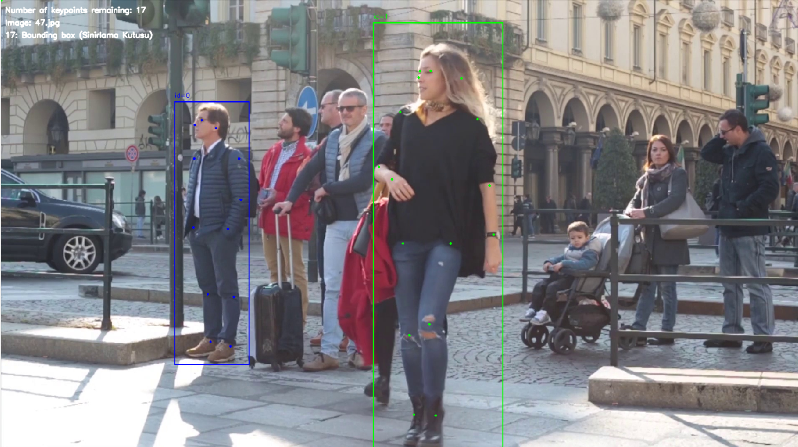

# Labeling Program for Pose Estimation

## Description

This labeling program is designed for pose estimation using OpenCV. It processes images in a specific folder, allows users to tag points by clicking on the image, and saves these points in the corresponding text file, normalizing the points. The program supports images in JPG, JPEG and PNG formats and creates or updates text files with the same name as the image files.

# Screenshot



## Features

- Display images in a window for labeling
- Assign points by clicking on the image
- Save points to a text file with the same name as the image
- Optimize file operations by continuously reading and detecting changes in label files
- Interface for selecting input and output folder paths

## Requirements

- Python 3.x
- OpenCV
- Tkinter

## Installation

1. Clone the repository:
   ```sh
   git clone https://github.com/kadiryavuzakinci/LabelKa

2. Navigate to the project directory:
   ```sh
   cd LabelKa

 3. Install the required dependencies:
    ```sh
    pip install opencv-python tk

## Usage

1. Place your images in a folder (e.g., data/images/train). (or you can set it from main.py file ) 

2. Run the main script:
   ```sh
   python3 main.py

3. The program will open a window displaying the first image in the folder.

   ## File Structure
    ```bash
    data
      images
          train
               ....jpg
          val
               ...jpg
       labels
          train
               ....jpg
      
          val
               ....jpg

## Key Bindings and Mouse Actions
 * ## Mouse Actions:

* Middle Button Click (MBUTTONDOWN): Start or complete drawing a bounding box.
* Left Button Click (LBUTTONDOWN): Add a keypoint within the bounding box.
* Mouse Move (MOUSEMOVE): Update the current bounding box dimensions while drawing.

* ## Key Bindings:

* d: Go to the next image.
* a: Go to the previous image.
* s: Save the labels for the current image.
* q: Quit the program.
* z: Add a default keypoint (0, 0) within the bounding box.
* r: Undo the last action (keypoint or bounding box).
* f: Delete a bounding box by ID.

## Code Structure
* main.py: Entry point of the program.
* image_processor.py: Contains the ImageProcessor class responsible for reading images, handling mouse events, and displaying images.
* label_manager.py: Manages the reading and saving of label files.
* ui_handler.py: Handles user input for deleting bounding boxes by ID.


## How to Use the Program
1. Start the Program: Run main.py which initializes the ImageProcessor with the folder paths for images and labels.

2. Navigate Images: Use d and a keys to navigate through the images in the specified folder.

3. Draw Bounding Boxes:

   * Click the middle mouse button to start drawing a bounding box.
   * Click again to complete the bounding box.

4. Annotate Keypoints:

   * After drawing a bounding box, click within the box to add keypoints.
   * Add up to 17 keypoints corresponding to different body parts.

5. Save Labels:

   * Press s to save the labels to a text file corresponding to the current image.
   * Ensure all keypoints are labeled before saving.

6. Undo and Redo:
   * Press r to undo the last keypoint or bounding box.
   * Press z to add a default keypoint (0, 0) if needed (For example, if you cannot see some keypoints depending on the camera angle, you can use).

7. Delete Bounding Box:

   * Press f to open a dialog and input the ID of the bounding box to delete.


## License
 This project is licensed under the MIT License. See the LICENSE file for details.
